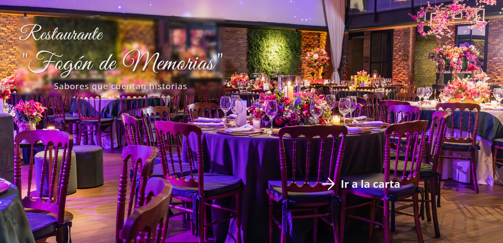
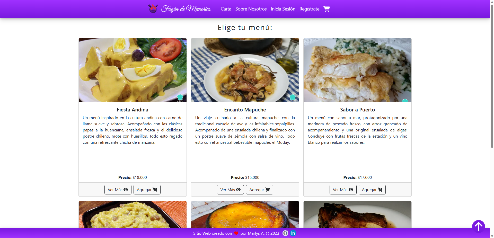
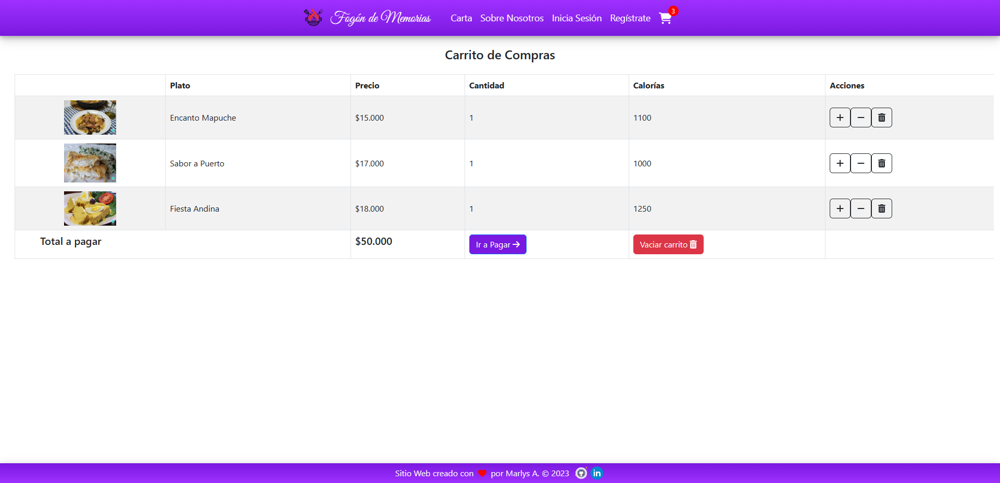
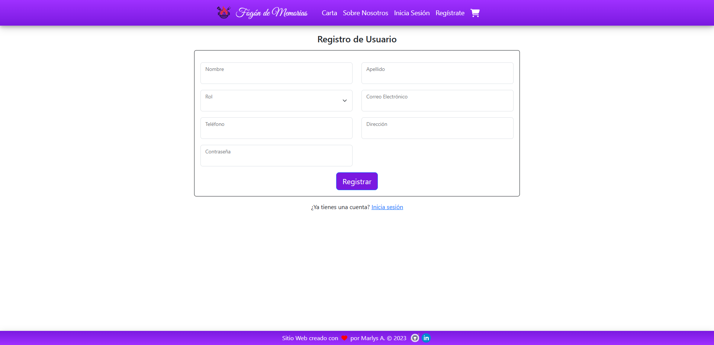

# Proyecto Final: Restaurante _"Fogón de Memorias"_

#### Ver deploy integrado con el backend en Netlify: 
#### **https://restaurante-fogon-memorias.netlify.app/**

## Descripción

En este proyecto se consolidarán los conocimientos adquiridos a lo largo de la Carrera Full Stack JavaScript, el cual está compuesto por 5 Hitos donde en primera instancia se trabajará en la ideación y prototipado del proyecto, luego se trabajará en el desarrollo frontend (hito 2) y backend (hito 3), para continuar con la integración y despliegue del proyecto (hito 4). Finalmente, en el quinto Hito se publicará la aplicación construida en un servidor y se realizará la presentación del proyecto.

## Objetivo

Desarrollar un proyecto para la construcción de una aplicación WEB con temática de una tienda online, aplicando Node/Express y otras tecnologías como PostgreSQL y CSS, para construir una herramienta que dé solución a una problemática específica.

## Unidades de aprendizaje: los hitos

- **Hito 1**: Diseñar la interfaz gráfica a desarrollar en el frontend, la estructura de carpetas y archivos en el backend con sus dependencias y contrato de datos y la relación de tablas en la base de datos.

- **Hito 2**: Desarrollar una aplicación Frontend con React que utilice React Router para la navegación de istas por rutas y Context API para el manejo de estado global.

- **Hito 3**: Crear una API REST con Express Js y el paquete pg para el consumo y manejo de recursos alojados en una base de datos PostgreSQL.

- **Hito 4**: Comprobar la comunicación entre la aplicación frontend y la API REST de forma local, posteriormente realizar el despliegue del proyecto y la creación de una base de datos PostgreSQL en heroku para permitir su uso en internet.

- **Hito 5**: Presentar el proyecto creado, exponiendo con la pantalla compartida sus funcionalidades, mencionando además los momentos que más destacaron durante su creación.

## Tecnologías Utilizadas

#### Frontend:

- react
- react-dom
- react-router
- react-fontawesome
- axios
- bootstrap
- react-bootstrap
- react-router-bootstrap
- react-confirm-alert
- react-scroll
- react-toastify
- react-transition-group
- jwt-decode

#### Backend:

- node js
- express
- bcrypt
- dotenv
- jsonwebtoken
- pg
- pg-format
- jest
- supertest
- nodemon

#### Base de datos

- PostgreSQL

## Uso

Puedes:

- Ver el menú y los distintos platos ofrecidos, además de la vista en detalle de cada uno.
- Agregar al carrito y probarlo (_no incluye la simulación de compra_).
- Registrarte como cliente o como administrador.
- Iniciar sesión una vez registrado. Según el rol, tendrás acceso a distintas funcionalidades.

## Ejemplos

#### Home

#### Menu

#### Carrito

#### Registro

## Consideraciones

Este es el primer trabajo que realizo integrando completamente el front con el backend, y utilizando una base de datos relacional en la nube, por lo cual estoy en pleno conocimiento de que existe mucho código por mejorar. 

Todos los recursos utilizados para desplegarlo (en el front Netlify, en el backend Vercel y como gestor de DB ElephantSQL) son **gratuitos**, razón por la cual puede existir intermitencias en sus servicios.

